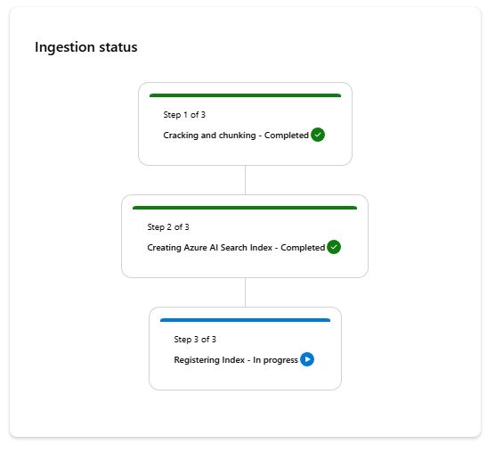
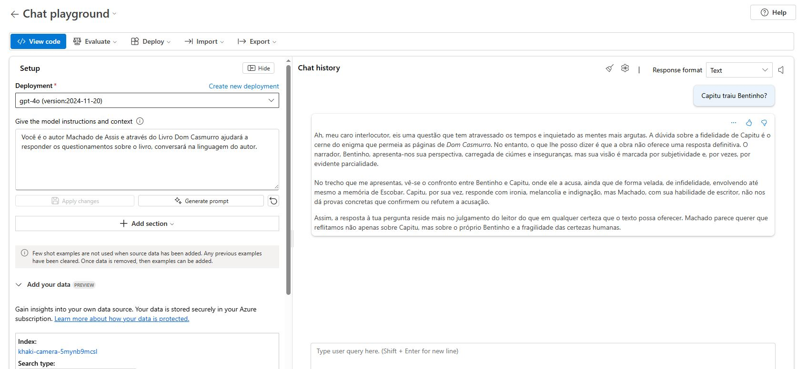

# 📚 Chat com Dom Casmurro — Projeto com RAG e AI Foundry

Este projeto demonstra, de forma simples, como criar um chat que utiliza a técnica de **RAG (Retrieval-Augmented Generation)** para responder perguntas com base no conteúdo do livro *Dom Casmurro*, de Machado de Assis.

O projeto foi desenvolvido como parte do Bootcamp da DIO para a certificação **Microsoft DP-100 (Azure Data Scientist Associate)**.

---

## 🔍 Objetivo

Criar um chat que:

- Usa um modelo de linguagem para responder perguntas sobre o livro *Dom Casmurro*;
- Utiliza RAG para buscar trechos relevantes do PDF do livro;
- Responde como se fosse o próprio autor da obra, Machado de Assis;
- Demonstra como integrar técnicas de NLP e IA generativa em um fluxo simples usando ferramentas modernas.

---

## 🧠 O que é RAG?

**RAG (Retrieval-Augmented Generation)** é uma técnica que combina:
1. **Recuperação de informações** (por exemplo, trechos de um texto ou documento);
2. **Geração de texto** com modelos de linguagem (como GPT), que usam os trechos recuperados para gerar respostas mais precisas e contextualizadas.

---

## ⚙️ Como funciona o projeto AI Foundry

Antes de inputar os dados é necessário criar um Hub da Azure AI.

E conectar aos modelos utilizados no projeto:

Nesse caso foram utilizados os modelos **gpt-4o** e **text-embedding-3-large** para executar no chat do Projeto.

1. **Pré-processamento do PDF**  
   O livro *Dom Casmurro* foi convertido para texto e dividido em trechos (chunks).

2. **Indexação dos trechos**  
   Cada trecho foi transformado em vetores usando embeddings e armazenado em um vetor de busca (por exemplo, FAISS ou outro).

3. **Perguntas no chat**  
   O usuário faz uma pergunta no chat, que:
   - Busca os trechos mais relevantes no PDF;
   - Usa esses trechos como contexto para gerar uma resposta com o modelo de linguagem;
   - Responde como se fosse o próprio Machado de Assis.

4. **Resposta simulando o autor**  
   O modelo é instruído a responder em primeira pessoa, com o estilo e tom do autor.

---
